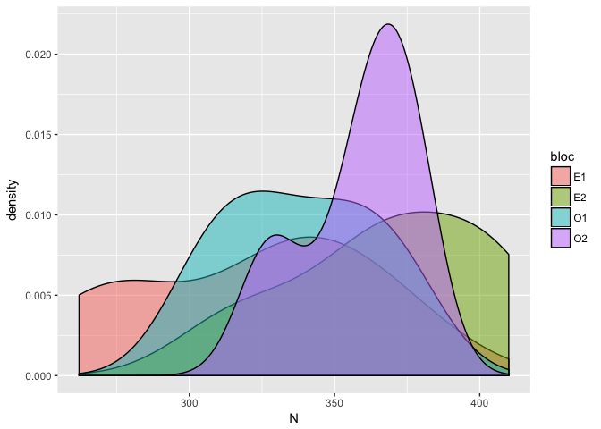
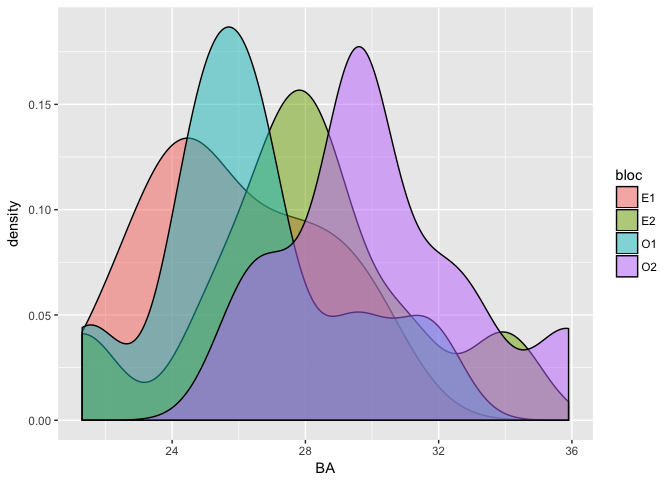
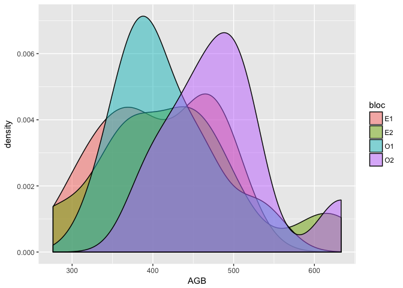
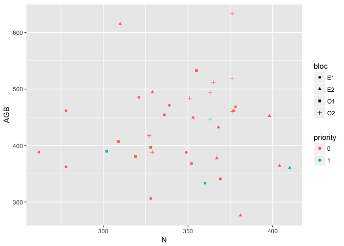
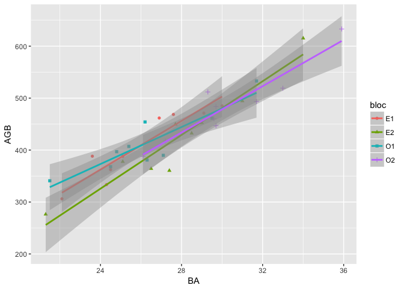
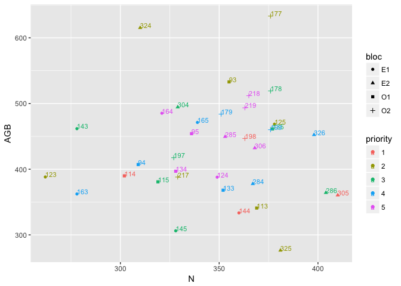

Plot Selection
================
Bruno Hérault
2/19/2018

-   [Plot description](#plot-description)
-   [High-intensity plots (Priority 1)](#high-intensity-plots-priority-1)
-   [Low-intensity plots](#low-intensity-plots)
    -   [Priority 2](#priority-2)
    -   [Priority 3](#priority-3)
    -   [Priority 4](#priority-4)
    -   [Priority 5](#priority-5)
-   [Overview of the sampling in the N-AGB space](#overview-of-the-sampling-in-the-n-agb-space)

Plot description
================

In the Loundoungo site, we have 4 times 9ha plots, each plot being subdivided into 9 times 1ha subplots. In the following are basic statistics of the subplots we have in hand.

    ##        N               BA             AGB       
    ##  Min.   :262.0   Min.   :21.30   Min.   :276.4  
    ##  1st Qu.:327.8   1st Qu.:25.10   1st Qu.:380.0  
    ##  Median :352.5   Median :27.30   Median :439.6  
    ##  Mean   :346.8   Mean   :27.58   Mean   :432.6  
    ##  3rd Qu.:370.8   3rd Qu.:29.62   3rd Qu.:474.4  
    ##  Max.   :410.0   Max.   :35.90   Max.   :633.1

Now density plots to assess variability visually

High-intensity plots (Priority 1)
=================================

Subplots that are located in the middle of each plot will be both prioritized and intensively monitored, meaning that 1/. the deadwood work will start here and 2/. the 4 already-set-up subsubplots will be all sampled for small stems, FIRST.

Subplots number are: 198, 114, 144, 305 Below are they summarized characteristics and their position in the N-AGB space.

    ##    bloc plot   N   BA   AGB
    ## 5    E1  144 360 24.3 333.5
    ## 14   E2  305 410 27.4 360.5
    ## 20   O1  114 302 27.1 389.9
    ## 32   O2  198 363 29.7 446.8

Low-intensity plots
===================

*The goal is to sample all subplots. We all agree on that.* Nevertheless, we look for the best subplot ranking in order to prevent our results from time problems. Because AGB and BA are highly correlated, we keep the first on to define the sampling procedure.

    ## 
    ##  Pearson's product-moment correlation
    ## 
    ## data:  data$AGB and data$BA
    ## t = 14.749, df = 34, p-value = 2.441e-16
    ## alternative hypothesis: true correlation is not equal to 0
    ## 95 percent confidence interval:
    ##  0.8660177 0.9639780
    ## sample estimates:
    ##       cor 
    ## 0.9299626

The procedure is the following, we calculate the distance matrix between normalized AGB and N values and then we chose within each plot the maximum distance to select the first 2 subplots to be samlpled. And so on. Doing so we will define 4 priority levels.

Priority 2
----------

    ##   bloc plot   N   BA   AGB
    ## 3   E1  125 378 27.6 468.6
    ## 1   E1  123 262 23.6 388.2

    ##    bloc plot   N   BA   AGB
    ## 17   E2  325 381 21.3 276.4
    ## 16   E2  324 310 34.0 615.3

    ##    bloc plot   N   BA   AGB
    ## 25   O1   93 355 31.7 532.9
    ## 19   O1  113 369 21.5 340.9

    ##    bloc plot   N   BA   AGB
    ## 34   O2  217 329 26.1 388.1
    ## 28   O2  177 376 35.9 633.1

The list of subplots of priority 2 is thus the following:

    ## [1] 125 123 325 324  93 113 217 177

Priority 3
----------

    ##   bloc plot   N   BA   AGB
    ## 6   E1  145 328 22.1 306.2
    ## 4   E1  143 278 26.9 461.7

    ##    bloc plot   N   BA   AGB
    ## 13   E2  304 329 31.0 494.5
    ## 12   E2  286 404 26.5 364.2

    ##    bloc plot   N   BA   AGB
    ## 24   O1  135 377 29.5 461.3
    ## 21   O1  115 319 26.3 380.8

    ##    bloc plot   N   BA   AGB
    ## 31   O2  197 327 27.2 417.5
    ## 29   O2  178 376 33.0 519.1

The list of subplots of priority 3 is thus the following:

    ## [1] 145 143 304 286 135 115 197 178

Priority 4
----------

    ##   bloc plot   N   BA   AGB
    ## 9   E1  165 339 29.1 471.2
    ## 7   E1  163 278 24.5 362.3

    ##    bloc plot   N   BA   AGB
    ## 18   E2  326 398 29.0 452.3
    ## 10   E2  284 367 25.1 377.7

    ##    bloc plot   N   BA   AGB
    ## 26   O1   94 309 25.4 407.1
    ## 22   O1  133 352 24.5 368.0

    ##    bloc plot   N   BA   AGB
    ## 33   O2  199 376 29.6 460.1
    ## 30   O2  179 351 29.7 483.9

The list of subplots of priority 4 is thus the following:

    ## [1] 165 163 326 284  94 133 199 179

Priority 5
----------

The remaining subplots are:

    ##    bloc plot   N   BA   AGB
    ## 2    E1  124 349 25.1 387.9
    ## 8    E1  164 321 30.0 485.2
    ## 11   E2  285 353 27.7 449.5
    ## 15   E2  306 368 28.5 432.3
    ## 23   O1  134 328 24.8 396.9
    ## 27   O1   95 336 26.2 454.1
    ## 35   O2  218 365 29.3 511.9
    ## 36   O2  219 363 31.7 493.4

Overview of the sampling in the N-AGB space
===========================================

Visually, we can see that we cath the extreme with priority 2. priority 5 are in the middle of the graph. Other priority levels in-between.

Mes amitiés à vos animaux de compagnie.
