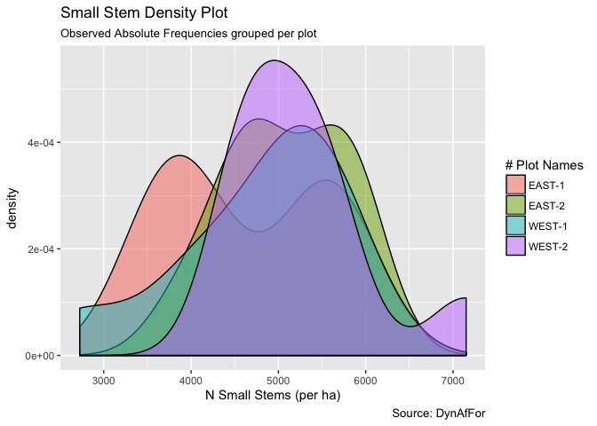
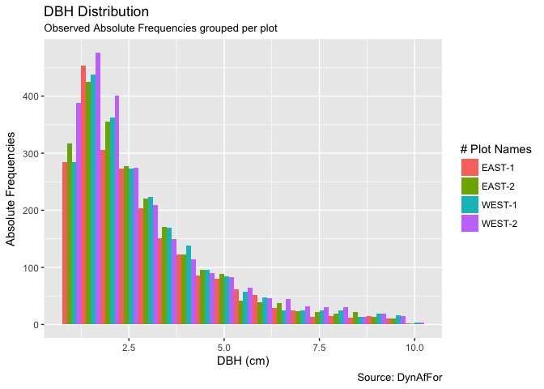
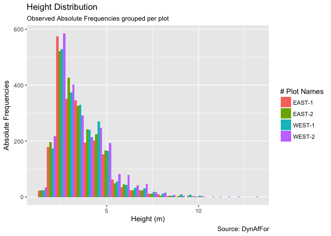

Carbon Pools Congo
================
Lattifa Fofana, Aimé Kouassi, Eric Forni, Sylvie Gourlet-Fleury & Bruno Hérault
6/6/2018

-   [Research Questions](#research-questions)
-   [Dead Biomass](#dead-biomass)
    -   [Descriptive Statistics](#descriptive-statistics)
    -   [Estimating Carbon Pool Values](#estimating-carbon-pool-values)
    -   [Estimating Carbon Pool Variabilities](#estimating-carbon-pool-variabilities)
-   [Small Stems](#small-stems)
    -   [Descriptive Statistics](#descriptive-statistics-1)
        -   [Stem Density](#stem-density)
        -   [DBH Distribution](#dbh-distribution)
        -   [Height Distribution](#height-distribution)
        -   [Basic Correlations](#basic-correlations)
    -   [Estimating Carbon Pool Values](#estimating-carbon-pool-values-1)
    -   [Estimating Carbon Pool Variabilities](#estimating-carbon-pool-variabilities-1)
-   [AboveGround Biomass](#aboveground-biomass)
    -   [Results from BIOMASS package](#results-from-biomass-package)
-   [Linking the 3 carbon pools](#linking-the-3-carbon-pools)
    -   [Results](#results)
    -   [Discussion](#discussion)

Research Questions
==================

*What is the magnitude of carbon pools in deadwood and small stems as compared to standard AGB (&gt;10 DBH) ?*

*Are there some ecologically-sound relationships between the 3 pools?*

*What is the level of environmental control on pools and relationships?*

Dead Biomass
============

Descriptive Statistics
----------------------

Estimating Carbon Pool Values
-----------------------------

Estimating Carbon Pool Variabilities
------------------------------------

Small Stems
===========

Descriptive Statistics
----------------------

### Stem Density

### DBH Distribution

### Height Distribution

### Basic Correlations

Estimating Carbon Pool Values
-----------------------------

Estimating Carbon Pool Variabilities
------------------------------------

AboveGround Biomass
===================

Results from BIOMASS package
----------------------------

Linking the 3 carbon pools
==========================

Results
-------

Discussion
----------
