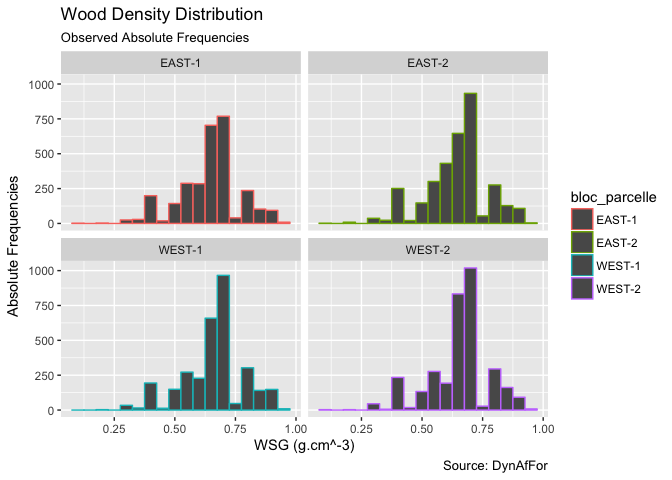
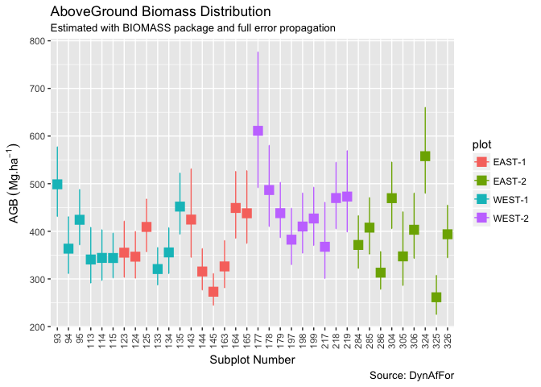

Carbon Pools Congo
================
Lattifa Fofana, Aimé Kouassi, Eric Forni, Sylvie Gourlet-Fleury & Bruno Hérault
6/6/2018

-   [Research Questions](#research-questions)
-   [Dead Biomass](#dead-biomass)
    -   [Descriptive Statistics](#descriptive-statistics)
        -   [Lying Deadwood](#lying-deadwood)
        -   [Standing Deadwood](#standing-deadwood)
        -   [Lying Volumes](#lying-volumes)
    -   [Estimating Carbon Pool Variabilities](#estimating-carbon-pool-variabilities)
-   [Small Stems](#small-stems)
    -   [Descriptive Statistics](#descriptive-statistics-1)
        -   [Stem Density](#stem-density)
        -   [DBH Distribution](#dbh-distribution)
        -   [Height Distribution](#height-distribution)
        -   [Basic Correlations](#basic-correlations)
    -   [Estimating Carbon Pool Values](#estimating-carbon-pool-values)
    -   [Estimating Carbon Pool Variabilities](#estimating-carbon-pool-variabilities-1)
-   [AboveGround Biomass](#aboveground-biomass)
    -   [Basic Checks](#basic-checks)
    -   [Results from BIOMASS package](#results-from-biomass-package)
-   [Linking the 3 carbon pools together](#linking-the-3-carbon-pools-together)
    -   [Small Stems versus Large Stems](#small-stems-versus-large-stems)

Research Questions
==================

*What is the magnitude of carbon pools in deadwood and small stems as compared to standard AGB (&gt;10 DBH) ?*

*Are there some ecologically-sound relationships between the 3 pools?*

*What is the level of environmental control on pools and relationships?*

Dead Biomass
============

Descriptive Statistics
----------------------

### Lying Deadwood

#### Density

#### Diameter

#### Length

#### Diameter-Length

### Standing Deadwood

#### Density

#### DBH

#### Height

 \#\#\#\# Diameter-Height  \#\# Estimating Carbon Pool Values

### Lying Volumes

 \#\#\# Standing Volumes 

Estimating Carbon Pool Variabilities
------------------------------------

Small Stems
===========

Descriptive Statistics
----------------------

### Stem Density

### DBH Distribution

### Height Distribution

### Basic Correlations

    FALSE `geom_smooth()` using method = 'gam'

Estimating Carbon Pool Values
-----------------------------

    ## The reference dataset contains 16467 wood density values 
    ## Your taxonomic table contains 410 taxa

Estimating Carbon Pool Variabilities
------------------------------------

AboveGround Biomass
===================

Basic Checks
------------

    ## The reference dataset contains 16467 wood density values 
    ## Your taxonomic table contains 241 taxa

Results from BIOMASS package
----------------------------

Linking the 3 carbon pools together
===================================

Small Stems versus Large Stems
------------------------------

    ## Warning: Ignoring unknown aesthetics: xmin, xmax

