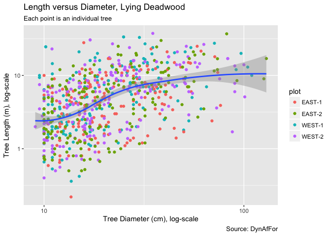
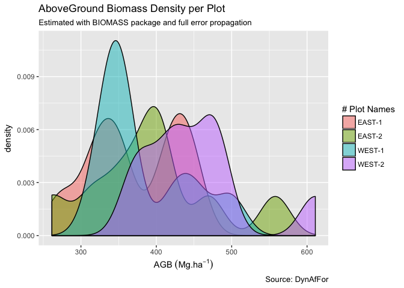

Carbon Pools Congo
================
Lattifa Fofana, Aimé Kouassi, Eric Forni, Sylvie Gourlet-Fleury & Bruno Hérault
6/6/2018

-   [Research Questions](#research-questions)
-   [Dead Biomass](#dead-biomass)
    -   [Descriptive Statistics](#descriptive-statistics)
        -   [Lying Deadwood](#lying-deadwood)
        -   [Standing Deadwood](#standing-deadwood)
    -   [Estimating Carbon Pool Values](#estimating-carbon-pool-values)
        -   [Lying Volumes](#lying-volumes)
        -   [Standing Volumes](#standing-volumes)
        -   [Standing versus Lying Volumes](#standing-versus-lying-volumes)
    -   [Estimating Carbon Pool Variabilities](#estimating-carbon-pool-variabilities)
-   [Small Stems](#small-stems)
    -   [Descriptive Statistics](#descriptive-statistics-1)
        -   [Stem Density](#stem-density)
        -   [DBH Distribution](#dbh-distribution)
        -   [Height Distribution](#height-distribution)
        -   [Basic Correlations](#basic-correlations)
    -   [Estimating Carbon Pool Values](#estimating-carbon-pool-values-1)
    -   [Estimating Carbon Pool Variabilities](#estimating-carbon-pool-variabilities-1)
-   [AboveGround Biomass](#aboveground-biomass)
    -   [Basic Checks](#basic-checks)
    -   [Results from BIOMASS package](#results-from-biomass-package)
-   [Linking the 3 carbon pools together](#linking-the-3-carbon-pools-together)
    -   [Small Stems versus Large Stems](#small-stems-versus-large-stems)

Research Questions
==================

*What is the magnitude of carbon pools in deadwood and small stems as compared to standard AGB (&gt;10 DBH) ?*

*Are there some ecologically-sound relationships between the 3 pools?*

*What is the level of environmental control on pools and relationships?*

Dead Biomass
============

Descriptive Statistics
----------------------

### Lying Deadwood

#### Density

-   Hypothesis - A few logging tracks have been seen in WEST plots. More lying deadwoods are expected there.

-   Results - No obvious difference between WEST and EAST

-   Discussion - The already-seen logging tracks have not impacted large trees.

#### Diameter

-   Hypothesis - In a mature forest, deadwoods are mostly young trees suppressed by competition with large trees

-   Results - A somewhat exponential decrease of DBH distribution

-   Discussion - We have a mature forest in hand, no obvious difference between plots

#### Length

-   Hypothesis - In a mature forest, deadwoods are mostly young trees with low heights (lengths) suppressed by competition with large trees

-   Results - A somewhat exponential decrease of length (height) distribution

-   Discussion - We have a mature forest in hand, no obvious difference between plots

#### Diameter-Length

    ## `geom_smooth()` using method = 'loess'

-   Hypothesis - Because of allometric relationships, we expect a positive correlation between length and DBH

-   Results - A weak tendency but a very large variability around this tendency

-   Discussion - We have two hypothesis to explain the weak link. (i) Decay rates are not homogeneous along the bole so that we have some parts fully decomposed and other parts almost-intact. This leads to a decoupling between length and DBH. (ii) Many boles/branches were broken at the time of falling. this may explain why we have many short pieces of large DBH

### Standing Deadwood

#### Density

-   Hypothesis - No difference between blocks/plots

-   Results - It seems that there is more standing deadwood on the WEST plots. to be verified with a statistical test (later)

-   Discussion - It looks like the WEST forest/plots is more senescent than the EAST forest/plots. We should have a look to the small stems density to verify this hypothesis.

#### DBH

-   Hypothesis - In a mature forest, deadwoods are mostly young trees suppressed by competition with large trees.

-   Results - A somewhat exponential decrease of DBH distribution. Note that in WEST-2, small DBH are over-represented.

-   Discussion - We have a mature forest in hand.

#### Height

-   Hypothesis - In a mature forest, standing deadwoods are mostly young trees with low heights (lengths) suppressed by competition with large trees

-   Results - A somewhat exponential decrease of height distribution

-   Discussion - We have a mature forest in hand, no obvious difference between plots

#### Diameter-Height

    ## `geom_smooth()` using method = 'loess'

-   Hypothesis - Because of allometric relationships, we expect a positive correlation between length and DBH

-   Results - A very weak tendency but a very large variability around this tendency

-   Discussion -Many boles/branches were broken at (or after) the time of death. This may explain why we have many short standing boles with large DBH

Estimating Carbon Pool Values
-----------------------------

### Lying Volumes

-   Hypothesis - A few logging tracks have been seen in WEST plots. More lying deadwood volumes are expected there.

-   Results - A subtle difference between WEST and EAST. Not statistically significant.

-   Discussion - The already-seen logging tracks have not strongly impacted large trees.

### Standing Volumes

-   Hypothesis - No difference between blocks/plots

-   Results - It seems that there is more standing deadwood on the WEST-1 plot. to be verified with a statistical test (later)

-   Discussion - These results confirm what we have already seen on the density analysis. It looks like the WEST forest/plots is more senescent than the EAST forest/plots. We should have a look to the small stems density to verify this hypothesis.

### Standing versus Lying Volumes

    ## `geom_smooth()` using method = 'loess'

-   Hypothesis 1 - All plots have similar maturity levels. In this case, we do expect no relationships between standing and lying deadwoods OR a negative relationships if total volumes remain stable and standing/lying compensate each other.

-   Hypothesis 2 - Plots have different maturity levels. In this case, we do expect a positive relationship between standing and lying deadwoods with LOW standing/lying values for young patches and HIGH standing/lying values for senescent patches.

-   Results - No obvious correlation. A tiny tendency for negative relationships.

-   Discussion - All plots have similar maturity levels.

<!-- -->

    ## `geom_smooth()` using method = 'loess'

-   Hypothesis 1 - All plots have similar maturity levels. In this case, we do expect no relationships between standing and lying deadwoods OR a negative relationships if total volumes remain stable and standing/lying compensate each other.

-   Hypothesis 2 - Plots have different maturity levels. In this case, we do expect a positive relationship between standing and lying deadwoods with LOW standing/lying values for young patches and HIGH standing/lying values for senescent patches.

-   Results - No correlation at all.

-   Discussion - It looks like standing and lying volumes are ramdomly distributed.

Estimating Carbon Pool Variabilities
------------------------------------

Small Stems
===========

Descriptive Statistics
----------------------

### Stem Density

-   Hypothesis - Similar maturity levels, no difference between block/plots.

-   Results - No obvious difference. On average 5000 stem/ha.

-   Discussion - Similar maturity levels. The number of small stems is more than 10 times the number of DBH&gt;10 trees.

### DBH Distribution

-   Hypothesis - In a mature forest, we expect a negative exponential distribution

-   Results - A somewhat exponential decrease of DBH distribution

-   Discussion - We have a mature forest in hand, no obvious difference between plots

### Height Distribution

-   Hypothesis - In a mature forest, we expect a negative exponential distribution

-   Results - A somewhat exponential decrease of height distribution

-   Discussion - We have a mature forest in hand, no obvious difference between plots

### Basic Correlations

    FALSE `geom_smooth()` using method = 'gam'

-   Hypothesis - Because of allometric relationships, we expect a positive correlation between height and DBH

-   Results - A positive and significant relationship

-   Discussion - Allometric relationship verified, can be used, in the future, to infer small\_stem\_AGB when height not available.

Estimating Carbon Pool Values
-----------------------------

    ## The reference dataset contains 16467 wood density values 
    ## Your taxonomic table contains 410 taxa

-   Hypothesis - From the literature analysis, we expect that the small stem biomass will be no more than 5-10% of the total biomass

-   Results - Small stem biomass in our subplot is between 10 and 20 T/ha. No obvious difference between plots.

-   Discussion - Assuming a total AGB between 300-400 T/ha, the proportion of this biomass is about 2.5-5% of the total AGB. Very low!

Estimating Carbon Pool Variabilities
------------------------------------

AboveGround Biomass
===================

Basic Checks
------------

    ## The reference dataset contains 16467 wood density values 
    ## Your taxonomic table contains 241 taxa

Results from BIOMASS package
----------------------------

Linking the 3 carbon pools together
===================================

Small Stems versus Large Stems
------------------------------

    ## Warning: Ignoring unknown aesthetics: xmin, xmax

    ## `geom_smooth()` using method = 'loess'

